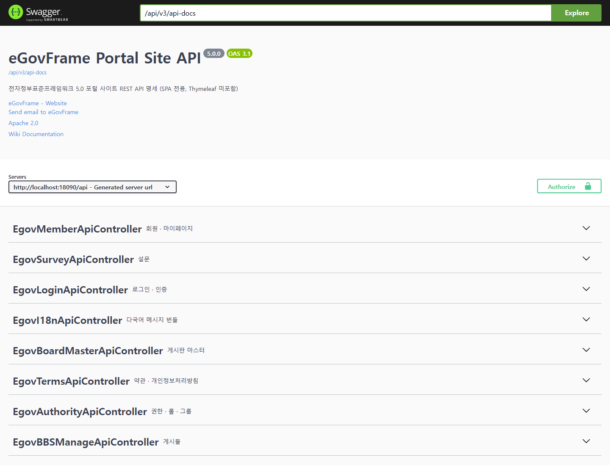

# egov-portal-api

전자정부표준프레임워크(eGovFrame) 5.0 기반 **포털 사이트**의 REST API 백엔드입니다.
서버 렌더링(Thymeleaf/JSP)은 포함하지 않습니다 — 화면은 별도 저장소의 프론트엔드가 담당합니다.

## 함께 쓰는 저장소

| 저장소 | 역할 | 개발 포트 |
|---|---|---|
| **egov-portal-api** (이 저장소) | REST API | 18090 (`/api`) |
| [egov-portal-react](https://github.com/gjh999/egov-portal-react) | React 19 프론트 | 13000 |
| [egov-portal-vue](https://github.com/gjh999/egov-portal-vue) | Vue 3 프론트 | 13001 |

두 프론트는 이 백엔드 하나를 함께 사용하며 기능이 서로 대등합니다.

> ⚠️ **이 저장소의 API 를 바꾸면 프론트 두 곳을 함께 고쳐야 합니다.**
> 계약 내용은 각 프론트 저장소의 `src/api/CONTRACT.md` 에 정리돼 있습니다.

## 화면

### Swagger UI



> 위 화면은 이 저장소를 실제로 기동해 촬영한 것입니다.
> 같은 시점의 기능 점검 결과(**18 / 18 통과**)는 [docs/VERIFICATION.md](docs/VERIFICATION.md) 에 있습니다.

---


## 1. 빠른 시작

| 도구 | 버전 |
|---|---|
| JDK | 17 |
| Maven | 3.9.x |

```bash
mvn spring-boot:run -Dspring-boot.run.jvmArguments="-Dfile.encoding=UTF-8"
```

**내장 HSQLDB**로 뜨므로 별도 DB 설치가 필요 없습니다.

API 문서(Swagger UI): <http://localhost:18090/api/swagger-ui.html>

### 테스트 계정

| 계정 | ID | 비밀번호 | 권한 |
|---|---|---|---|
| 관리자 | `admin` | `1` | ROLE_ADMIN |
| 사용자 | `user` | `1` | ROLE_USER |

---

## 2. 제공 기능

| 영역 | 기능 | 접근 권한 |
|---|---|---|
| 메인 | 배너·공지·FAQ 요약 (1회 호출) | 공개 |
| 게시판 | 목록·상세·등록·수정·답변·삭제, 첨부파일 | 조회 공개 / 쓰기 로그인 |
| 게시판 마스터 | 게시판 생성·속성 관리 | 조회 공개 / 편집 관리자 |
| 게시판 사용정보 | 어떤 대상이 어떤 게시판을 쓰는지 | 관리자 |
| 템플릿 | 게시판 표시 형식 | 관리자 |
| FAQ | 목록·상세·등록·수정·삭제 | 조회 공개 / 편집 로그인 |
| Q&A | 목록, 작성비밀번호 확인 후 상세, 답변 | 조회 공개 / 답변 관리자 |
| 설문 | 템플릿·설문·문항·항목·응답 | 관리 관리자 / 참여 로그인 |
| 약관 | 이용약관·개인정보처리방침 (버전·대표 지정) | 조회 공개 / 편집 관리자 |
| 배너 | 노출 배너 조회, 배너 관리 | 조회 공개 / 편집 관리자 |
| 회원 | 가입(일반/기업), 아이디 중복확인, 목록 | 가입 공개 / 관리 관리자 |
| 내 정보 | 조회·수정, 비밀번호 변경 | 로그인 |
| 권한 | 권한·롤·그룹·사용자권한 매핑 | 관리자 |
| 시스템 | 공휴일, 우편번호 | 공휴일 조회 공개 / 나머지 관리자 |
| 다국어 | 메시지 번들 (ko/en) | 공개 |

---

## 3. API 규약

### 3-1. 기준 경로

모든 엔드포인트는 `/api` 아래에 있습니다 (`server.servlet.context-path=/api`).

### 3-2. 인증 — JWT + HttpOnly 쿠키

```
POST /api/auth/login-jwt   → Set-Cookie: ACCESS_TOKEN=...; HttpOnly; Path=/; SameSite=Lax
GET  /api/auth/logout      → 쿠키 만료
GET  /api/auth/me          → 로그인 사용자 + roles (비로그인이면 resultCode 401)
```

**토큰은 응답 본문에 실리지 않습니다.** 프론트는 모든 요청에 `credentials: 'include'` 를 붙여야 합니다.

> 서버 렌더링 시절에는 세션(HttpSession)에 SecurityContext 를 저장했습니다. SPA 로 오면서 STATELESS 로 바꾸고,
> JWT 필터가 요청마다 `EgovUserDetails` principal 을 SecurityContext 에 넣습니다 — eGovFrame RTE 의
> `EgovUserDetailsHelper` 가 이 타입을 전제로 하기 때문에, **다른 타입을 넣으면 서비스 전반에서 로그인 사용자가
> `null` 로 보여 조용히 망가집니다.**

### 3-3. 비밀번호는 평문으로 전송합니다 ⚠️

이 포털의 저장값은 **단일 해시** `Base64(SHA-256(id ‖ password))` 이고, 해싱은 **서버**가 담당합니다
(`EgovFileScrty.encryptPassword`). 클라이언트가 미리 해싱해 보내면 서버가 그 값을 한 번 더 해싱해
절대 일치하지 않습니다.

평문이 네트워크에 노출되지 않도록 **운영 배포에는 HTTPS 가 필수**입니다.

> eGovFrame 계열 템플릿 중에는 **이중 해시**를 쓰는 것도 있어 프론트가 1차 해시를 담당하기도 합니다.
> **다른 프로젝트에서 로그인 코드를 복사해 오면 인증이 통째로 깨집니다.**

### 3-4. 응답 형태

```jsonc
{ "resultCode": 200,   "resultMessage": "성공했습니다.", "result":   { ... } }  // 대부분의 API
{ "resultCode": "200", "resultMessage": "성공했습니다.", "resultVO": { ... } }  // 로그인·인증 API
```

`resultCode` 는 HTTP 상태와 **별개**입니다 (200 이어도 401/403/900 일 수 있음).

| resultCode | 뜻 |
|---|---|
| 200 | 성공 |
| 300 | 로그인 실패 |
| 401 | 미인증 |
| 403 | 권한 없음 |
| 700 / 800 | 삭제 / 저장 중 내부 오류 |
| 900 | 입력값 검증 실패 |

### 3-5. 주요 엔드포인트

| 기능 | 메서드·경로 | 권한 |
|---|---|---|
| 메인 구성 | `GET /main` | 공개 |
| 게시물 목록·상세 | `GET /boards/{bbsId}/articles[/{nttId}]` | 공개 |
| 게시물 등록·수정 | `POST·PUT /boards/{bbsId}/articles[/{nttId}]` (multipart) | 로그인 / 작성자·관리자 |
| 게시물 답변 | `POST /boards/{bbsId}/articles/{nttId}/replies` (multipart) | 로그인 |
| 게시물 삭제 | `DELETE /boards/{bbsId}/articles/{nttId}` | 작성자·관리자 |
| 게시판 목록·상세 | `GET /board-masters[/{bbsId}]` | 공개 |
| 게시판 관리 | `POST·PUT·DELETE /admin/board-masters` | 관리자 |
| 게시판 사용정보 | `GET·POST·PUT·DELETE /board-use[/{trgetId}/{bbsId}]` | 관리자 |
| 템플릿 | `GET·POST·PUT·DELETE /templates[/{tmplatId}]`, `GET /templates/{id}/preview` | 관리자 |
| FAQ | `GET·POST·PUT·DELETE /faq[/{faqId}]` | 조회 공개 / 편집 로그인 |
| Q&A 목록·상세 | `GET /qna[/{qaId}]` | 공개 |
| Q&A 비밀번호 확인 | `POST /qna/{qaId}/verify` | 공개 |
| Q&A 답변 | `PUT /admin/qna/{qaId}/answer` | 관리자 |
| 설문 | `GET·POST·PUT·DELETE /surveys/**` | 관리자 |
| 설문 참여 | `POST /survey-responses` | 로그인 |
| 약관·방침(노출본) | `GET /terms/stplat`, `GET /terms/privacy` | 공개 |
| 약관 관리 | `/stplat/**`, `/privacy-policies/**` | 관리자 |
| 배너(노출) | `GET /banners` | 공개 |
| 회원가입 | `POST /members/join/{general\|enterprise}` | 공개 |
| 아이디 중복확인 | `GET /members/check-id/{id}` | 공개 |
| 회원 관리 | `/admin/members/**` | 관리자 |
| 내 정보 | `GET·PUT /mypage`, `PUT /mypage/password` | 로그인 |
| 권한·롤·그룹 | `/authorities/**`, `/roles/**`, `/groups/**`, `/author-*/**` | 관리자 |
| 공휴일 | `GET /restde`, `/admin/restde/**` | 조회 공개 / 편집 관리자 |
| 우편번호 | `/zip/**` | 관리자 |
| 다국어 번들 | `GET /i18n/{ko\|en}` | 공개 |

### 3-6. 다국어

화면 문구의 원본은 이 저장소의 `src/main/resources/egovframework/message/message-ui_{ko,en}.properties` 입니다.
`GET /i18n/{lang}` 이 이를 JSON 으로 내려주고, **두 프론트가 같은 번들을 받아 씁니다.**

ko/en 은 **키 집합이 같아야** 합니다. 한쪽에만 키를 추가하면 다른 언어에서 키 문자열이 그대로 노출됩니다.

> 프론트가 쓰는 화면 문구 키 254 개 중 **251 개(99%)** 가 이 번들에 등록돼 있어
> 언어 전환이 실제로 동작합니다. 나머지 2 개는 값이 끼어드는 문구(첨부 최대 개수 등)라 프론트 대비값으로 둡니다.

---

## 4. 배포

```bash
mvn clean package
java -jar target/egov-portal-api-5.0.0.jar
```

| 환경변수 | 기본값(개발용) | 설명 |
|---|---|---|
| `EGOV_JWT_SECRET` | placeholder | JWT 서명 키 (32자 이상 무작위) |
| `EGOV_CRYPTO_KEY` | `egovframe` | 암호화 서비스 키 |
| `JWT_COOKIE_SECURE` | `false` | HTTPS 배포 시 `true` |
| `JWT_COOKIE_SAMESITE` | `Lax` | 프론트와 API 의 등록도메인이 다르면 `None` (+ Secure) |
| `EGOV_ALLOW_ORIGIN` | `localhost:13000,13001` | 실제 프론트 도메인 (와일드카드 금지) |

프론트와 API 를 **같은 도메인**에 두고 `/api` 를 프록시하면 쿠키 문제가 생기지 않습니다.

### 컨테이너로 실행

`Dockerfile` 과 `k8s/` 매니페스트가 들어 있습니다. 기본 프로필이 내장 HSQLDB 라
**DB 컨테이너 없이 이 이미지 하나로** 뜹니다.

```bash
docker build -t egov-portal-api:latest .
docker run --rm -p 18090:18090 egov-portal-api:latest
```

세트로 띄우려면 `docker-compose.yml` 을 쓰세요 — 이 백엔드와 프론트 두 개가 함께 뜹니다.
프론트 저장소를 같은 상위 디렉터리에 clone 해 두어야 합니다.

```bash
git clone https://github.com/gjh999/egov-portal-api.git
git clone https://github.com/gjh999/egov-portal-react.git
git clone https://github.com/gjh999/egov-portal-vue.git
cd egov-portal-api && docker compose up --build
# API 18090 · React 13000 · Vue 13001
```

### DB 전환

`src/main/resources/application.properties` 의 `Globals.DbType` 을 변경하고
`DATABASE/` 의 해당 DBMS DDL·DML 을 적재합니다.

지원: `hsql` · `postgresql` · `mysql` · `oracle` · `altibase` · `tibero` · `cubrid`

---

## 5. 테스트

```bash
mvn test    # JUnit 15건
```

| 무엇을 지키는가 |
|---|
| JWT 생성·검증·위조 거부 |
| 쿠키 인증 계약 — 로그인 응답 **본문에 토큰이 없을 것** |
| 권한별 접근 제어 (관리자 API 401), 공개 API 접근 |
| ko/en 번들 키 정합 — 한쪽에만 키가 있으면 그 화면만 깨진다 |

> 테스트는 랜덤 포트로 앱을 띄웁니다. **18090 에서 개발 서버가 떠 있으면 내장 HSQLDB 파일 락이 충돌해
> 500 이 납니다** — 테스트 전에 개발 서버를 내려 주세요.

---

## 6. 프로젝트 구조

```
src/main/java/egovframework/
├── com/                     공통
│   ├── cmm/                 공통 VO·서비스·유틸
│   │   ├── util/            페이지네이션 유틸
│   │   └── web/             파일 다운로드, 이미지, 다국어 번들, 전역 예외 처리
│   ├── config/              Java @Configuration
│   ├── jwt/                 JWT 유틸·필터·인증 진입점
│   └── security/            SecurityConfig
└── let/                     업무
    ├── cop/bbs/             게시판 · 게시판 마스터
    ├── cop/com/             게시판 사용정보 · 템플릿
    ├── main/                메인 화면 구성
    ├── sec/                 권한 · 롤 · 그룹
    ├── sym/                 공휴일 · 우편번호
    ├── uat/uia/             로그인
    ├── uss/olh/faq · qna/   FAQ · Q&A
    ├── uss/olp/             설문
    ├── uss/sam/             약관 · 개인정보처리방침
    ├── uss/ion/bnr/         배너
    └── uss/umt/             회원 · 마이페이지

src/main/resources/
├── egovframework/mapper/    MyBatis XML (DBMS 별 분리)
├── egovframework/message/   다국어 메시지 (ko/en) — 프론트도 이 파일을 씁니다
└── db/shtdb.sql             HSQLDB 초기 스키마 + 시드
```

---

## 7. 알아두면 좋은 것

- **Q&A 는 비회원도 글을 남길 수 있습니다.** 본인 확인은 글마다 지정한 작성비밀번호로 하며,
  상세를 보기 전에 `POST /qna/{qaId}/verify` 로 확인합니다.
- **약관은 여러 버전 중 "대표"로 지정된 하나만 노출됩니다.**
- **게시물 답변의 트리 위치는 서버가 정합니다.** 부모·정렬·깊이를 요청 본문에서 읽지 않고
  원글에서 읽어 채우므로, 클라이언트가 조작해도 스레드 순서가 망가지지 않습니다.
- **권한 판정은 현재 `admin` 계정만 관리자로 취급합니다.** 데모 데이터에 권한 매핑 테이블이 채워져 있지 않기
  때문이며, 실제 운영에서는 `EgovLoginApiController#resolveRole` 을 권한 테이블 조회로 바꿔야 합니다.
- **존재하지 않는 경로는 404 가 아니라 401 이 날 수 있습니다.** Spring Security 가 인증 검사를 먼저 수행합니다.
- 이 백엔드에는 **JSP·Thymeleaf 관련 의존성과 코드가 없습니다.**

---

## 라이선스

Apache License 2.0 — [LICENSE](LICENSE)

전자정부표준프레임워크 포털 사이트 템플릿을 기반으로 합니다.
